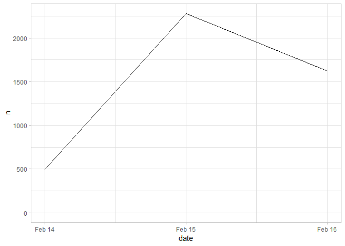
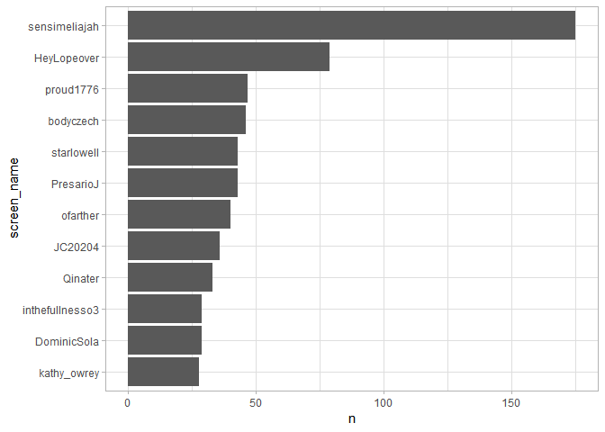
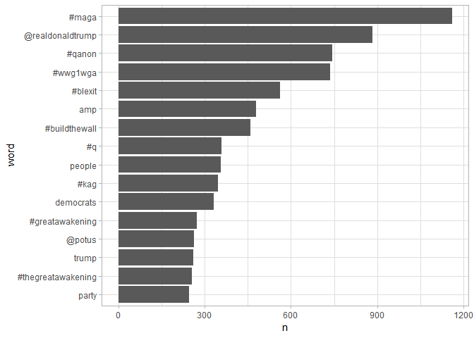
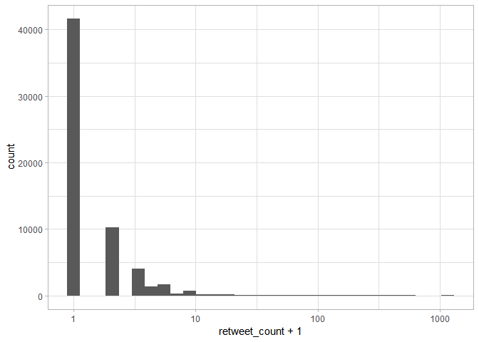

Messing around with the tweets
================
Nicolas Restrepo
February 18, 2019

Messing around with the tweets
------------------------------

``` r
library(tidyverse)
```

    ## -- Attaching packages ---------------------------------------------------------------------------------------------------------------- tidyverse 1.2.1 --

    ## v ggplot2 3.1.0     v purrr   0.2.5
    ## v tibble  2.0.1     v dplyr   0.7.8
    ## v tidyr   0.8.2     v stringr 1.3.1
    ## v readr   1.3.1     v forcats 0.3.0

    ## -- Conflicts ------------------------------------------------------------------------------------------------------------------- tidyverse_conflicts() --
    ## x dplyr::filter() masks stats::filter()
    ## x dplyr::lag()    masks stats::lag()

``` r
library(rebus)
```

    ## 
    ## Attaching package: 'rebus'

    ## The following object is masked from 'package:stringr':
    ## 
    ##     regex

    ## The following object is masked from 'package:ggplot2':
    ## 
    ##     alpha

``` r
library(stringi)
library(lubridate)
```

    ## 
    ## Attaching package: 'lubridate'

    ## The following object is masked from 'package:base':
    ## 
    ##     date

``` r
library(tidytext)

theme_set(theme_light())
```

``` r
# Load the data 

tweets <- readRDS("~/R_Documents/conversion-narratives/walkaway_tweets.rds")
```

I begin by looking at when the tweets have been posted

``` r
# Date of tweets 

tweets %>% 
  count(date = as.Date(created_at)) %>% 
  ggplot(aes(x = date, y = n)) + 
  geom_line() + 
  expand_limits(y = 0 )
```



Users with the most tweets?

``` r
tweets %>%  
  count(screen_name, sort = TRUE ) %>% 
  head(12) %>% 
  mutate(screen_name = reorder(screen_name, n)) %>% 
  ggplot(aes(screen_name, n)) + 
  geom_col() + 
  coord_flip()
```



Maybe worth checking the tweets by these users.

What about retweets?

``` r
tweets %>% 
  arrange(desc(retweet_count)) %>%  
  select(screen_name, text, retweet_count) %>% 
  view()
```

So this is interesting because most of the most "impactful" tweets haven't been by the people who have used the hashtag the most.

What if we take both things into account?

``` r
tweets %>% 
  group_by(screen_name) %>% 
  summarize(tweets = n(), 
            retweets = sum(retweet_count)) %>% 
  arrange(desc(tweets)) %>% 
  arrange(desc(retweets))
```

    ## # A tibble: 2,098 x 3
    ##    screen_name     tweets retweets
    ##    <chr>            <int>    <int>
    ##  1 usminority           8     2452
    ##  2 SandraTXAS           1     1159
    ##  3 ChuckCallesto        1     1082
    ##  4 Joy_Villa            1      509
    ##  5 GregNorberg          3      463
    ##  6 thatsqueensnark      1      423
    ##  7 Barracuda_Bella      1      388
    ##  8 Unite4Truth          1      378
    ##  9 stripedbanana3       1      284
    ## 10 DonnaWR8            15      270
    ## # ... with 2,088 more rows

Wildly different picture. It seems the top three users here are quite impactful.

What about fave / retween ratio

``` r
tweets %>% 
  select(screen_name, text, retweet_count, favorite_count) %>%  
  mutate(ratio = (favorite_count + 1) / (retweet_count + 1)) %>%  
  arrange(desc(ratio))
```

    ## # A tibble: 4,400 x 5
    ##    screen_name  text                     retweet_count favorite_count ratio
    ##    <chr>        <chr>                            <int>          <int> <dbl>
    ##  1 Speedy62269  @IlhanMN @realDonaldTru~             0             16  17  
    ##  2 DWDrummer13  @dbongino Did you tell ~             1             32  16.5
    ##  3 sargentoart  "@usminority I’m just h~             3             55  14  
    ##  4 AlohaPlay    @lgbtqnation @TuckerCar~             0             13  14  
    ##  5 Darlachic    "@holymtnbike @MrAndyNg~             0             12  13  
    ##  6 AnalizeThis  @seanhannity Think Dems~             0             10  11  
    ##  7 JerForce     @DanRather I’m old enou~             4             51  10.4
    ##  8 GnomeGnuts   @DrShayPhD They did the~             1             16   8.5
    ##  9 JT_Crawdaddy "@StephenKing @warnerth~             0              7   8  
    ## 10 KungFuLife3  @HardTru78495307 @Chuck~             0              7   8  
    ## # ... with 4,390 more rows

Worth looking into these top tweets. Are they particularly problematic and/or offensive?

I am going to begin to think about the content of the tweets.

``` r
# fewer columns 

tweet_words <- tweets %>% 
  select(screen_name, text, retweet_count, favorite_count, created_at) %>%  
  unnest_tokens(word, text, token = "tweets") %>%  # this makes sure keep hashtags and @s 
  anti_join(stop_words, by = "word")  %>% # super handy dataset from the tidytext package 
  filter(word != "#walkaway")

# Plot most common words 

tweet_words %>%  
  count(word, sort = TRUE ) %>% 
  head(16) %>% 
  mutate(word = reorder(word, n)) %>% 
  ggplot(aes(word, n)) + 
  geom_col() + 
  coord_flip()
```



This just seems like another propaganda campaign by rightwing bots

We could check at which words had an impact by looking whether they were retweeted or liked

``` r
# Distribution of retweets 

tweet_words %>%  
  ggplot(aes(retweet_count + 1)) + 
  geom_histogram() + 
  scale_x_log10()
```

    ## `stat_bin()` using `bins = 30`. Pick better value with `binwidth`.



``` r
# Because it's so skewed we cannot use average or median 

tweet_words %>%  
  group_by(word) %>% 
  summarise(n = n(), 
            avg_retweets = exp(mean(log(retweet_count + 1))) - 1, 
            avg_favorites = exp(mean(log(favorite_count + 1))) -1) %>% 
  filter(n >= 30) %>%  
  arrange(desc(avg_retweets)) %>%  
  head(n = 20)
```

    ## # A tibble: 20 x 4
    ##    word                      n avg_retweets avg_favorites
    ##    <chr>                 <int>        <dbl>         <dbl>
    ##  1 @realpersonpltcs         50        1.89          2.67 
    ##  2 #reopenfastandfurious    52        1.81          2.54 
    ##  3 #backtheblue             46        1.76          2.61 
    ##  4 #shutitdown              43        1.72          2.55 
    ##  5 @bordernarcotics         43        1.72          2.55 
    ##  6 video                    46        1.60          1.83 
    ##  7 2020                     50        1.51          2.21 
    ##  8 #proofofliferbg          47        1.50          2.28 
    ##  9 billion                  31        1.48          2.14 
    ## 10 @thebestcloser           82        1.22          1.68 
    ## 11 #closernation            91        1.14          1.53 
    ## 12 ny                       39        1.13          1.46 
    ## 13 #prolife                 50        1.08          1.05 
    ## 14 #military                35        1.06          0.544
    ## 15 #news                    38        1.05          1.44 
    ## 16 #us                      32        1.03          1.66 
    ## 17 #spygate                 59        1.02          1.32 
    ## 18 #metoo                   49        0.974         0.739
    ## 19 mccabe                   34        0.935         1.10 
    ## 20 4                        32        0.907         1.31

Again, we mostly see hashtags up there on the list. @realpersonpltcs is quite impactful.

We can create a tf\_idf for each day to see how they have changed

``` r
# create specific day 

tweet_words <- tweet_words %>% 
  mutate( day = round_date(created_at, "day")) 

# Which words are more specific to particular days 

tweet_words %>% 
  count(word, day) %>% 
  bind_tf_idf(word, day, n) %>% 
  arrange(desc(tf_idf)) %>% 
  group_by(day) %>% 
  top_n(1, tf_idf) %>% 
  arrange(day) %>% 
  print()
```

    ## # A tibble: 4 x 6
    ## # Groups:   day [3]
    ##   word              day                     n       tf   idf   tf_idf
    ##   <chr>             <dttm>              <int>    <dbl> <dbl>    <dbl>
    ## 1 #thursdaythoughts 2019-02-15 00:00:00    15 0.000760  1.10 0.000834
    ## 2 @walkawayed       2019-02-16 00:00:00    18 0.000631  1.10 0.000694
    ## 3 @amdenijs7        2019-02-17 00:00:00     9 0.000693  1.10 0.000761
    ## 4 @nillajdt         2019-02-17 00:00:00     9 0.000693  1.10 0.000761

``` r
# This is not suuuper helpful 

# Although it is interesting to see that most of them are handles 
```
